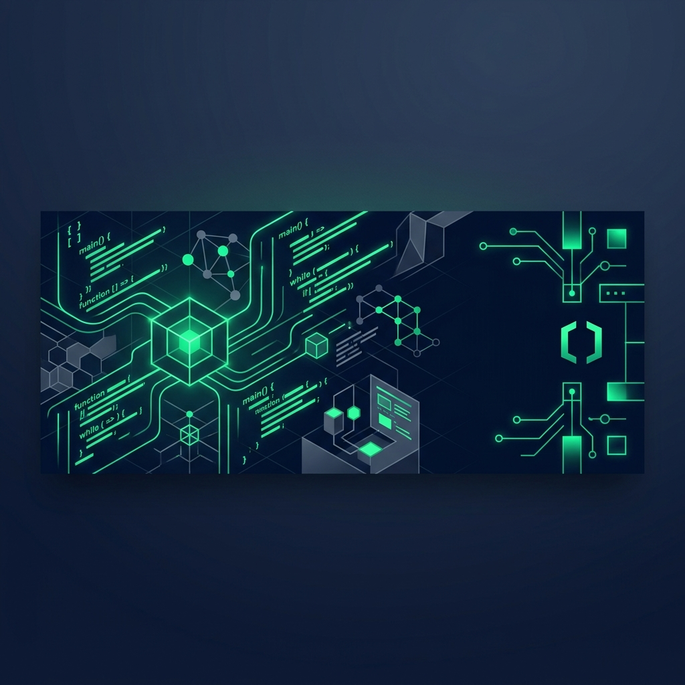

# DevCraft – Technical Freelancer Blog

DevCraft is a high-end, bespoke editorial platform built specifically for technical freelancers and senior software engineers. Designed with a meticulous "Modern Developer" aesthetic, it prioritizes typography, deep colors, and an ambient reading experience to showcase deep-dive technical prose, architectural musings, and pragmatic code snippets.

 

## ✨ Features

- **Modern Developer Aesthetic**: A deeply customized design system using Tailwind CSS with dark navy (`#0F172A`), slate surfaces, and emerald (`#10B981`) accents.
- **Dynamic Theming**: First-class support for both Light and Dark modes with seamless cross-page synchronization via `localStorage` and OS-level preference detection.
- **Bespoke Typography**: Utilizes `Inter` for crisp UI elements, `Newsreader` for immersive long-form reading, and `Space Grotesk` for code blocks.
- **Advanced Markdown Support**: Fully styled prose components with custom blockquotes, inline code formatting, and syntax-ready preformatted text blocks.
- **Secure Admin Dashboard**: Protected routes for content management. Includes a sleek, sidebar-driven interface for drafting, publishing, editing, and deleting articles.
- **Smart Reading Time Estimation**: Automatically calculates and displays reading times based on word count across the platform.
- **Category Filtering**: Seamless taxonomy system allowing visitors to filter content by technical domains (e.g., Architecture, TypeScript, Laravel, DevOps).

## 🛠️ Technology Stack

- **Backend Framework**: Laravel 13
- **Database**: MySQL (configured via Eloquent ORM)
- **Frontend Tooling**: Vite
- **Styling**: Tailwind CSS (with fully custom CSS variables for dynamic theming)
- **Icons**: Google Material Symbols Outlined
- **Fonts**: Google Fonts

## 🚀 Getting Started

Follow these instructions to get a copy of the project up and running on your local machine for development and testing purposes.

### Prerequisites

- PHP >= 8.3
- Composer
- Node.js & NPM
- MySQL

### Installation

1. **Clone the repository**
   ```bash
   git clone https://github.com/UssMad/BlogPersonnel
   cd devcraft-blog
   ```

2. **Install PHP Dependencies**
   ```bash
   composer install
   ```

3. **Install NPM Dependencies**
   ```bash
   npm install
   ```

4. **Environment Setup**
   Copy the example `.env` file and generate an application key.
   ```bash
   cp .env.example .env
   php artisan key:generate
   ```

5. **Database Configuration**
   Update your `.env` file with your local database credentials:
   ```env
   DB_CONNECTION=mysql
   DB_HOST=127.0.0.1
   DB_PORT=3306
   DB_DATABASE=devcraft_db
   DB_USERNAME=root
   DB_PASSWORD=
   ```

6. **Run Migrations and Seeders**
   This will set up the database schema and populate it with categories, a default admin user, and sample articles.
   ```bash
   php artisan migrate:fresh --seed
   ```
   *Note: The default admin credentials are:*
   - **Email:** `admin@devcraft.io`
   - **Password:** `password`

7. **Compile Frontend Assets**
   ```bash
   npm run build
   ```

8. **Start the Development Server**
   ```bash
   php artisan serve
   ```

Visit `http://127.0.0.1:8000` in your browser to see the application. Access the admin panel at `http://127.0.0.1:8000/login`.

## 📁 Architecture Overview

- `app/Models/`: Contains the `Article`, `Category`, and `User` Eloquent models.
- `app/Http/Controllers/ArticleController.php`: Manages both public-facing views and the secured admin CRUD operations.
- `database/migrations/`: Defines the schema, notably ensuring a strict relationship between Users, Articles, and Categories.
- `resources/css/app.css`: The core styling file where the Light/Dark mode CSS variables are defined and mapped.
- `tailwind.config.js`: Heavily customized to read from CSS variables, enabling dynamic opacity and theme switching.
- `resources/views/`: Contains all Blade templates, split into `layouts` (Admin/Public), `articles`, and `auth`.

## 🎨 Design System implementation

The platform utilizes a complex CSS-variable based implementation within Tailwind. 

Instead of writing `dark:bg-slate-900 bg-white` on every element, the application defines strict RGB variables in `app.css`:

```css
:root { --c-surface: 248 250 252; } /* Light */
.dark { --c-surface: 19 19 21; }    /* Dark */
```

Which are then mapped in `tailwind.config.js`:
```javascript
colors: {
    'surface': 'rgb(var(--c-surface) / <alpha-value>)',
}
```
This allows classes like `bg-surface/50` to automatically adapt to the current theme while maintaining opacity support.

## 📄 License

This project is open-sourced software licensed under the [MIT license](https://opensource.org/licenses/MIT).
